# EviMem-RL：面向持续科学数据策展的证据担保记忆与安全强化学习  
## 最终 Methods 与 Pipeline 设计规范

> **文档定位**：本文件描述在现有 EviPGCE 基础上，进一步发展为可投稿 ICLR / ICML / NeurIPS 的完整方法方案。  
> **核心目标**：不再训练一个“记住更多材料知识”的领域大模型，而是训练一个能够在严格发布安全边界内，持续学习如何寻找证据、利用历史经验、处理冲突并分配人工审查预算的科学策展智能体。  
> **建议方法名**：**EviMem-RL**  
> **全称**：**Evidence-Warranted Memory and Constrained Reinforcement Learning for Continual Scientific Curation**

---

# 1. 研究问题

现有科学信息抽取通常把一篇论文独立处理，目标是从全文中输出结构化记录。然而，真实科学数据库建设具有四个被静态抽取忽略的特征：

1. **数据库是持续更新的**：后续论文可能补充、修正或否定此前记录。
2. **证据通常分散**：材料、数值、单位和实验条件可能位于不同段落、表格或图注中。
3. **策展具有成本约束**：读取全文、检查表格、调用模型和请求专家均有成本。
4. **错误不能被直接写入数据库**：智能体可以提出候选，但不能拥有最终发布权。

因此，我们将科学数据策展定义为一个**带有历史记忆、证据约束、有限预算和确定性安全边界的序列决策问题**。

给定按时间到达的文献流：

\[
\mathcal{D}_{1:T}=\{D_1,D_2,\ldots,D_T\},
\]

智能体需要针对每篇论文执行多步证据获取与验证，并决定：

- 下一步读取哪一块证据；
- 是否检查表格、图注或上下文窗口；
- 是否检索历史已验证或已拒绝的相似案例；
- 是否继续搜索、暂缓、请求专家或结束；
- 是否提交一个候选记录给确定性发布门控。

智能体的目标不是直接最大化原始候选数量，而是在安全约束下最大化：

\[
\text{Verified scientific utility}
-
\text{retrieval cost}
-
\text{model cost}
-
\text{human review cost}.
\]

最终数据库记录只能由确定性 publication harness 发布，学习模块不能绕过该边界。

---

# 2. 核心思想

EviMem-RL 在现有 EviPGCE 的“开放世界候选生成、闭世界确定性发布”框架上增加两个学习模块：

1. **Evidence-Warranted Memory（证据担保记忆）**  
   历史记录只有在携带证据引用、验证证书、政策版本和决策状态时，才能成为可复用记忆。

2. **Memory-Conditioned Evidence Acquisition Policy（记忆条件化证据获取策略）**  
   智能体通过强化学习决定下一步读取什么、何时停止、何时请求人工，而不是依赖固定证据编译规则。

整个系统由三层组成：

- **学习层**：候选提出、记忆检索、动作决策；
- **验证层**：证据绑定、元组级验证、领域约束和冲突处理；
- **治理层**：不可变 evidence release、版本化 DomainPack、原子 publication commit 和完整审计链。

关键原则为：

> **The agent may learn how to search, remember, and defer; it may not learn to bypass verification or publish unsupported records.**

---

# 3. 总体架构

```mermaid
flowchart LR
    A[Scientific Paper Stream] --> B[Immutable Evidence Release]
    B --> C[Initial LLM Candidate Proposer]

    C --> D[Candidate Claim State]
    M[Evidence-Warranted Memory] --> E[Memory Retriever]
    E --> D

    D --> F[RL Evidence Acquisition Controller]

    F -->|Retrieve passage| G[Evidence Store]
    F -->|Inspect table/caption| G
    F -->|Expand context| G
    F -->|Retrieve prior case| M
    F -->|Ask human| H[Expert Review]
    F -->|Defer / Stop| I[Terminal Request]

    G --> J[Deterministic Verification Harness]
    H --> J
    J --> K[Evidence Binding]
    K --> L[Tuple-Level Verification]
    L --> N[DomainPack Policy Check]
    N --> O[Conflict Resolution]
    O --> P[Publication Gate]

    P -->|Verified-Strong| Q[Atomic Publication Commit]
    P -->|Rejected / Ambiguous| R[Audit & Review Store]

    Q --> S[Published Observation + Certificate]
    R --> T[Rejected / Deferred Certificate]

    S --> U[Memory Consolidation]
    T --> U
    U --> M
```



---

# 4. 与现有 EviPGCE 的关系

EviMem-RL **不推翻**现有 EviPGCE，而是把它重新定位为不可越过的安全执行环境。

## 4.1 保留的核心组件

以下组件继续作为系统的确定性基础：

- immutable evidence blocks；
- typed `EvidenceRef`；
- versioned `EvidenceRelease`；
- LLM candidate proposer；
- DomainPack；
- evidence binding；
- tuple-level content verification；
- constraint validation；
- conflict resolution；
- strict publication gate；
- atomic and idempotent `PublicationCommitService`；
- publication certificate 和 provenance lineage。

## 4.2 替换或升级的组件

| 当前组件 | 最终升级 |
|---|---|
| 固定 evidence compiler | 可学习的证据获取策略 |
| 每篇论文独立抽取 | 连续文献流与跨论文记忆 |
| 普通历史记录 | 携带证据与证书的 warranted memory |
| 固定规则决定搜索顺序 | RL controller 决定下一步动作 |
| 只评估 extraction / publication F1 | 同时评估安全、成本、记忆利用和持续更新 |
| 静态 DomainPack | 版本化政策；智能体可提出 patch，但不能自动启用 |

---

# 5. 问题形式化

在时间步 \(t\)，系统接收论文 \(D_t\)、证据发布版本 \(R_t\)、领域政策 \(P^{(v)}\)、历史记忆库 \(\mathcal{M}_{t-1}\) 和预算 \(B_t\)。

LLM proposer 首先产生候选集合：

\[
\mathcal{C}_t = f_{\text{prop}}(D_t, R_t, P^{(v)}).
\]

对每个候选 \(c\in\mathcal{C}_t\)，智能体执行一个多步轨迹：

\[
\tau_c=(s_0,a_0,s_1,a_1,\ldots,s_H),
\]

其中 \(s_h\) 是当前策展状态，\(a_h\) 是证据获取或决策动作。

策略为：

\[
a_h\sim \pi_\theta(a\mid s_h,\mathcal{M}_{t-1}).
\]

最终，智能体只能输出一个**publication request**，而不能直接发布。确定性 harness 计算：

\[
\Pi(c)=
\text{Schema}(c)
\land
\text{Domain}(c,P^{(v)})
\land
\text{Bound}(c)
\land
\text{Verified}(c)
\land
\text{Valid}(c,P^{(v)})
\land
\text{ConflictFree}(c).
\]

只有当：

\[
\Pi(c)=1
\quad\text{and}\quad
\tau(c)=\text{Verified-Strong}
\]

时，记录才可写入 publication store。

整体优化目标为：

\[
\max_\theta
\mathbb{E}_{\tau\sim\pi_\theta}
\left[
U_{\text{verified}}(\tau)
-
\lambda_c C_{\text{tool}}(\tau)
-
\lambda_l C_{\text{token}}(\tau)
-
\lambda_h C_{\text{human}}(\tau)
-
\lambda_r C_{\text{redundancy}}(\tau)
\right]
\]

满足硬安全约束：

\[
\Pr(\text{unverified record is materialized})=0.
\]

该安全约束不通过奖励近似实现，而通过外部 deterministic publication gate 强制执行。

---

# 6. 规范化数据对象

系统应避免继续扩展多个相互重叠的 schema。最终只保留以下六类核心对象。

## 6.1 EvidenceRef

表示不可变证据位置。

```yaml
evidence_ref:
  release_id: "release_2026_07_13"
  document_id: "doi:10.xxxx/xxxx"
  block_id: "ev_f49af0b6a38ff940"
  locator_type: "table_cell | table_row | paragraph | sentence | caption | figure"
  locator:
    page: 5
    section: "Results"
    table_id: "Table 3"
    row: 4
    column: 2
  checksum: "sha256:..."
```

要求：

- 可稳定重放；
- 与 evidence release 绑定；
- 不允许指向可变文本；
- 可以定位到 paragraph、table row、cell、caption 或 figure region。

---

## 6.2 CandidateObservation

LLM 提出的开放世界候选，初始状态永远为 `unpublished`。

```yaml
candidate:
  candidate_id: "cand_..."
  property_key: "d33"
  value_raw: "43"
  unit_raw: "pC/N"
  material_raw: "0.64PNN ceramic"
  composition_raw: "..."
  condition_raw:
    electric_field: "20 kV/cm"
    temperature: "room temperature"
  proposer_model: "..."
  proposer_confidence: 0.74
  evidence_hints:
    - "ev_f49af0b6a38ff940"
  publication_status: "unpublished"
```

候选对象不能包含可被系统信任的 `published=true` 字段。

---

## 6.3 ClaimState

表示当前候选各验证槽位的状态。

```yaml
claim_state:
  candidate_id: "cand_..."
  slots:
    property:
      status: "verified"
      evidence_refs: ["..."]
    value:
      status: "verified"
      evidence_refs: ["..."]
    unit:
      status: "verified"
      evidence_refs: ["..."]
    material:
      status: "ambiguous"
      evidence_refs: ["..."]
    composition:
      status: "missing"
      evidence_refs: []
    condition.temperature:
      status: "verified"
      evidence_refs: ["..."]
  unresolved_slots:
    - "material"
    - "composition"
  conflict_status: "unknown"
  remaining_budget:
    token: 6000
    tool_calls: 8
    human_queries: 1
```

每个槽位状态只能是：

- `missing`
- `candidate`
- `bound`
- `verified`
- `ambiguous`
- `conflicting`
- `invalid`

---

## 6.4 WarrantedMemoryItem

这是最终方法的核心对象。

```yaml
memory_item:
  memory_id: "mem_..."
  memory_type: "verified | rejected | conflict | correction | policy"
  claim_signature:
    domain: "piezoelectric"
    property_key: "d33"
    material_family: "PZT"
    condition_signature: "room_temperature"
  normalized_content:
    value: 43.0
    unit: "pC/N"
    material: "Pb0.94Ni0.21Nb0.42Zr0.06Ti0.30O3"
  evidence_refs:
    - "ev_f49af0b6a38ff940"
  certificate_id: "cert_..."
  decision:
    status: "published | rejected | deferred | superseded"
    reason: "verified_strong | ambiguous_material | unit_invalid | conflict"
  authority:
    source: "deterministic_harness | human_curator"
    level: 3
  policy_version: "piezoelectric@1.3.0"
  evidence_release_id: "release_..."
  valid_from: "2026-07-13"
  valid_until: null
  supersedes: []
  contradicted_by: []
```

一条 memory 能否进入可复用记忆库，不由 LLM 自己决定，而由证书状态决定。

---

## 6.5 VerificationCertificate

记录确定性验证的完整结论。

```yaml
certificate:
  certificate_id: "cert_..."
  candidate_id: "cand_..."
  evidence_release_id: "release_..."
  domain_pack:
    name: "piezoelectric"
    version: "1.3.0"
    checksum: "sha256:..."
  slot_verification:
    property: "verified"
    value: "verified"
    unit: "verified"
    material: "verified"
    conditions: "verified"
  binding_method: "normalized_quote_match"
  support_tier: "verified_strong"
  constraint_result: "pass"
  conflict_result: "pass"
  final_decision: "publish"
  exclusion_reasons: []
```

---

## 6.6 CurationTrajectory

用于训练 RL、审计和重放。

```yaml
trajectory:
  trajectory_id: "traj_..."
  run_id: "run_..."
  candidate_id: "cand_..."
  initial_state_hash: "..."
  steps:
    - step: 0
      state_hash: "..."
      action: "retrieve_table"
      action_args:
        table_id: "Table 3"
      cost:
        tokens: 0
        tool_calls: 1
      verifier_delta:
        newly_verified_slots: ["value", "unit"]
    - step: 1
      action: "expand_context"
      action_args:
        evidence_ref: "..."
        window: 2
      verifier_delta:
        newly_verified_slots: ["material"]
  terminal_action: "request_publication"
  final_certificate_id: "cert_..."
  total_reward: 3.72
```

---

# 7. Evidence-Warranted Memory

## 7.1 为什么不是普通向量记忆

普通 agent memory 往往保存自然语言摘要，例如：

> “某种材料的 d33 大约是 43 pC/N。”

这种记忆存在四个问题：

- 不知道来自哪篇论文；
- 不知道数值对应哪种材料或条件；
- 不知道是否已通过独立验证；
- 不知道它适用于哪个 DomainPack 版本。

EviMem-RL 只允许带有以下信息的历史经验影响后续关键动作：

\[
m=(\text{claim},\text{evidence},\text{certificate},
\text{policy version},\text{decision},\text{validity}).
\]

---

## 7.2 记忆类型

### A. Verified memory

来自已经发布的 Verified-Strong observation。

用途：

- 提供已知 alias、常见条件和材料表达；
- 发现同一材料的新测量值；
- 帮助定位历史上有效的证据类型；
- 检测新结果是否与旧记录冲突。

### B. Rejected memory

来自确定性拒绝，且拒绝原因可靠。

典型原因：

- unit incompatible；
- material mismatch；
- ambiguous evidence；
- missing required condition；
- false-positive pattern；
- same value attached to multiple materials。

用途：

- 避免重复犯错；
- 优先检查此前容易遗漏的字段；
- 为控制器提供负经验。

### C. Conflict memory

记录彼此不兼容但均有证据的候选。

用途：

- 引导搜索条件差异；
- 识别不同温度、成分、晶相或测量方法；
- 避免错误去重。

### D. Human-corrected memory

由专家确认或修正。

权限高于自动记忆，但仍需保留：

- 原始 evidence；
- 人工修改字段；
- 修改原因；
- 适用政策版本。

### E. Policy memory

记录 DomainPack 版本变化以及受影响的规则。

例如：

- 新增 property alias；
- 新增单位映射；
- 某材料族允许的属性发生变化；
- 某个点群规则被修订。

---

## 7.3 记忆准入规则

| 证据与决策状态 | 可否进入长期记忆 | 权限 |
|---|---:|---:|
| Verified-Strong + published | 是 | 高 |
| Human-confirmed correction | 是 | 最高 |
| Deterministic rejected + 明确原因 | 是 | 中高 |
| Ambiguous evidence | 仅短期 episodic memory | 低 |
| Weak co-occurrence | 否 | 无 |
| LLM self-reflection without certificate | 否 | 无 |
| 未绑定 evidence 的自由文本 | 否 | 无 |

因此，记忆写入是**治理过程**，而不是让 LLM 自由总结。

---

## 7.4 记忆检索

给定当前候选状态 \(s\)，检索分数定义为：

\[
\text{Score}(m,s)
=
\alpha\,\text{SemanticSim}(m,s)
+
\beta\,\text{StructureMatch}(m,s)
+
\gamma\,\text{PolicyCompat}(m,s)
+
\eta\,\text{Authority}(m)
-
\delta\,\text{Staleness}(m)
-
\xi\,\text{ConflictRisk}(m,s).
\]

其中：

- `SemanticSim`：文本或 embedding 相似度；
- `StructureMatch`：property、material family、condition 等结构槽位匹配；
- `PolicyCompat`：DomainPack 版本是否兼容；
- `Authority`：human-confirmed > verified-strong > deterministic rejection；
- `Staleness`：记忆是否过期或被 supersede；
- `ConflictRisk`：该记忆是否存在未解决冲突。

检索后不应把完整自然语言历史直接拼入 prompt，而是转化为结构化提示：

```yaml
retrieved_constraints:
  known_aliases: [...]
  likely_evidence_locations: ["table", "caption"]
  prior_failure_modes: ["material_ambiguity"]
  possible_conflicts: [...]
  required_checks: ["temperature", "composition"]
```

---

# 8. 记忆条件化的状态表示

控制器在第 \(h\) 步看到的状态为：

\[
s_h =
\left[
z_{\text{candidate}},
z_{\text{slots}},
z_{\text{evidence}},
z_{\text{memory}},
z_{\text{policy}},
z_{\text{budget}},
z_{\text{history}}
\right].
\]

具体包含：

1. **Candidate representation**
   - property；
   - value；
   - unit；
   - material；
   - composition；
   - conditions。

2. **Verification slot state**
   - 已验证槽位；
   - 缺失槽位；
   - 冲突槽位；
   - 当前证据层级。

3. **Available evidence index**
   - passage；
   - table；
   - caption；
   - metadata；
   - unresolved references。

4. **Retrieved warranted memories**
   - positive cases；
   - rejected cases；
   - conflict cases；
   - policy updates。

5. **DomainPack context**
   - required fields；
   - compatible units；
   - range constraints；
   - material-family rules；
   - point-group physics。

6. **Budget**
   - token；
   - tool call；
   - wall-clock；
   - human review。

7. **Action history**
   - 已读取证据；
   - 已调用工具；
   - 无效重复动作；
   - 最近 verifier delta。

---

# 9. 动作空间

最终动作空间应保持小而明确，避免让 RL 在大量自由文本动作中训练不稳定。

## 9.1 Evidence actions

```text
RETRIEVE_PASSAGE(query)
RETRIEVE_TABLE(property_or_value)
INSPECT_TABLE_CELL(table_id, row, col)
INSPECT_CAPTION(figure_or_table_id)
EXPAND_LOCAL_WINDOW(evidence_ref, radius)
FOLLOW_CROSS_REFERENCE(reference_id)
```

## 9.2 Memory actions

```text
RETRIEVE_VERIFIED_MEMORY(signature)
RETRIEVE_REJECTED_MEMORY(signature)
RETRIEVE_CONFLICT_MEMORY(signature)
CHECK_POLICY_HISTORY(property_or_material)
```

## 9.3 Verification actions

```text
REQUEST_SLOT_VERIFICATION(slot_name)
REQUEST_CONFLICT_CHECK()
REQUEST_DOMAIN_VALIDATION()
```

验证动作只调用确定性 harness，不由控制器自行产生结论。

## 9.4 Human actions

```text
ASK_HUMAN(slot_name, evidence_bundle)
```

仅允许在以下情况使用：

- 关键槽位长期 ambiguous；
- 多条强证据冲突；
- 可能需要 DomainPack 更新；
- 人工审查的预期价值高于成本阈值。

## 9.5 Terminal actions

```text
REQUEST_PUBLICATION
DEFER_FOR_REVIEW
REJECT_CANDIDATE
STOP_NO_RECORD
```

`REQUEST_PUBLICATION` 只表示请求，最终结果仍由 publication gate 决定。

---

# 10. Deterministic Verification Harness

## 10.1 Evidence binding

对每个候选字段建立到 immutable evidence block 的绑定。

建议绑定级联：

1. exact quote match；
2. normalized quote match；
3. exact table-cell match；
4. table row alignment；
5. property–value–unit co-localization；
6. compiled anchor resolution；
7. cross-reference resolution。

绑定成功不代表内容已验证。

---

## 10.2 Tuple-level verification

候选只有在同一有效证据窗口中同时满足以下字段时，才可成为 Verified-Strong：

\[
\phi(c,b)
=
I[p_c\in b]
\land I[v_c\in b]
\land I[u_c\in b]
\land I[m_c\in b]
\land
\bigwedge_{\kappa\in K_c}I[\kappa\in b].
\]

其中：

- \(p_c\)：property；
- \(v_c\)：value；
- \(u_c\)：unit；
- \(m_c\)：material / composition / sample；
- \(K_c\)：DomainPack 规定的必要条件。

为支持真实论文中的 distributed evidence，最终版应增加**受控多块证据组合**：

\[
\phi_{\text{multi}}(c,\mathcal{B})
=
\text{Connected}(\mathcal{B})
\land
\text{NoEntitySwitch}(\mathcal{B})
\land
\text{AllSlotsSupported}(c,\mathcal{B}).
\]

其中 `Connected` 要求证据块通过以下至少一种关系连接：

- 同一表格行或表头；
- 同一段落；
- 明确代词或样品编号；
- 交叉引用；
- 相同材料/sample ID；
- 明确的 section-local context。

这样可以补足当前单一 localization window 对 distributed evidence 的低召回问题，同时仍保持可审计。

---

## 10.3 DomainPack validation

DomainPack 负责：

- canonical property ontology；
- aliases；
- binding anchors；
- unit compatibility；
- expected ranges；
- required condition fields；
- material-family allowed/forbidden properties；
- point-group physics；
- false-positive patterns。

学习策略可以决定何时调用这些检查，但不能修改检查结果。

---

## 10.4 Conflict resolution

冲突键建议定义为：

\[
k(c)=
(\text{property},
\text{material},
\text{composition},
\text{condition},
\text{measurement method}).
\]

同一 property 下的不同值并不自动冲突。只有在以下条件均一致而数值不兼容时，才标记 conflict：

- material identity；
- composition；
- phase / sample；
- measurement condition；
- measurement method；
- unit canonicalization。

冲突处理结果：

- `distinct_context`：保留为不同记录；
- `exact_duplicate`：去重；
- `resolvable_conflict`：选择证据更强的记录；
- `unresolved_conflict`：禁止发布并进入审查。

---

## 10.5 Publication gate

最终发布条件：

```text
schema_valid
AND domain_known
AND evidence_bound
AND tuple_verified
AND constraints_passed
AND conflict_free
AND support_tier == VERIFIED_STRONG
AND strict_profile == true
AND run_scoped_artifact == true
```

任何不满足条件的候选进入 audit/review store，并保留具体 exclusion reason。

---

# 11. 强化学习方法

## 11.1 学习目标

RL 不学习“某个科学事实是真是假”，而学习：

- 如何以更低成本补齐 verification slots；
- 如何利用历史成功或失败经验；
- 何时继续检索；
- 何时请求人工；
- 何时停止并 defer；
- 何时提交 publication request。

---

## 11.2 控制器结构

建议使用一个冻结或 LoRA 微调的 1.5B–3B 语言模型作为 controller，并增加离散 action head。

输入：

```text
candidate schema
+ current slot state
+ evidence index
+ retrieved warranted memories
+ DomainPack requirements
+ remaining budget
+ past actions
```

输出：

```yaml
action:
  type: "RETRIEVE_TABLE"
  arguments:
    query: "d33 43 pC/N"
  rationale_code:
    target_slot: "material"
    expected_information_gain: "high"
```

训练时可以保留 rationale code 作为辅助监督，但推理时真正执行的是结构化 action。

---

## 11.3 两阶段训练

### Stage A：轨迹模仿预训练

从现有 pipeline、启发式搜索和 oracle evidence path 构造轨迹。

监督目标：

\[
\mathcal{L}_{\text{BC}}
=
-\sum_h \log \pi_\theta(a_h^*\mid s_h).
\]

轨迹来源：

- 当前 evidence compiler 的固定路径；
- gold evidence 反推的 oracle 路径；
- 人工策展轨迹；
- 成功与失败运行日志；
- 对失败轨迹进行最小修正得到的 counterfactual trajectory。

目标是让 controller 先学会基本工具调用和停止行为。

---

### Stage B：Verifier-Shaped Constrained GRPO

针对同一个候选状态，采样 \(K\) 条动作轨迹：

\[
\{\tau_1,\tau_2,\ldots,\tau_K\}.
\]

每条轨迹由 deterministic verifier 计算 reward。采用组内标准化 advantage：

\[
A_i =
\frac{R(\tau_i)-\mu_R}{\sigma_R+\epsilon}.
\]

策略目标：

\[
\mathcal{L}_{\text{GRPO}}
=
-
\mathbb{E}_{i,h}
\left[
\min
\left(
r_{i,h}A_i,
\operatorname{clip}(r_{i,h},1-\epsilon,1+\epsilon)A_i
\right)
\right]
+
\beta\,
D_{\mathrm{KL}}(\pi_\theta\|\pi_{\text{ref}}).
\]

其中：

\[
r_{i,h}
=
\frac{\pi_\theta(a_{i,h}\mid s_{i,h})}
{\pi_{\text{old}}(a_{i,h}\mid s_{i,h})}.
\]

为适配单张 4090：

- proposer 冻结；
- verifier 冻结；
- 只训练 controller 的 LoRA；
- action space 离散；
- 每条轨迹限制最大步数；
- 可以先使用离线缓存 evidence；
- 在线阶段仅在小规模 episode 上进行。

---

## 11.4 Verifier-shaped reward

即时奖励：

\[
r_h =
\alpha\Delta V_h
+
\beta\Delta A_h
+
\gamma\Delta C_h
-
\lambda_1 \text{ToolCost}_h
-
\lambda_2 \text{TokenCost}_h
-
\lambda_3 \text{RepeatedAction}_h
-
\lambda_4 \text{HumanCost}_h.
\]

其中：

- \(\Delta V_h\)：新验证槽位数量；
- \(\Delta A_h\)：ambiguity 减少量；
- \(\Delta C_h\)：冲突被正确区分或解决；
- `RepeatedAction`：重复读取相同证据的惩罚。

终局奖励：

\[
R_{\text{terminal}}=
\begin{cases}
+R_p, & \text{正确发布 Verified-Strong record}\\
+R_d, & \text{正确 defer 一个不可安全发布的候选}\\
+R_r, & \text{正确拒绝 false positive}\\
-R_m, & \text{在预算充足时遗漏可验证记录}\\
-R_u, & \text{请求发布但被 gate 拒绝}\\
-R_h, & \text{不必要地请求人工}
\end{cases}
\]

总奖励：

\[
R(\tau)
=
\sum_h r_h
+
R_{\text{terminal}}.
\]

必须避免把“候选数量”作为正奖励，否则控制器可能通过生成更多低质量候选进行 reward hacking。

---

## 11.5 硬安全机制

强化学习安全不依赖惩罚项，而通过三种硬机制保证：

### 1. Action masking

控制器不能直接调用数据库写入接口。

### 2. External verification

所有 slot status、support tier 和 conflict result 由 deterministic harness 返回。

### 3. Atomic commit authority

只有 `PublicationCommitService` 能写入 publication store，并且要求：

- valid run；
- strict profile；
- gate pass；
- Verified-Strong certificate；
- DomainPack identity；
- evidence release identity；
- idempotent commit key。

---

# 12. Memory Consolidation

每个 episode 结束后，系统根据证书生成 memory candidate。

## 12.1 正向记忆

满足：

```text
support_tier == VERIFIED_STRONG
AND publication_status == PUBLISHED
```

写入：

- claim signature；
- evidence path；
- successful action trajectory；
- certificate；
- policy version。

---

## 12.2 负向记忆

满足：

```text
deterministic rejection
AND exclusion_reason is stable
AND evidence is bound
```

例如：

- `ambiguous_material`
- `incompatible_unit`
- `missing_required_condition`
- `false_positive_pattern`
- `context_switch`

负向记忆应保存“为什么失败”，而不是保存模型的自由文本反思。

---

## 12.3 记忆合并

两个 memory 只有在以下 key 一致时才可合并：

```text
domain
property
material identity
composition
condition signature
policy compatibility
decision type
```

不能仅根据 embedding 相似度合并。

---

## 12.4 记忆失效与 supersession

若后续论文或政策更新推翻历史记录：

```yaml
memory_status: "superseded"
superseded_by:
  - "mem_new..."
reason: "new_stronger_evidence | policy_update | curator_correction"
```

旧记忆不删除，而是降低检索权重并保留审计链。

---

# 13. DomainPack 演化

DomainPack 自动修改不应作为主实验的必要条件，但可以作为高级扩展。

智能体只能提出：

```yaml
domain_patch_proposal:
  target_version: "1.3.0"
  proposed_change:
    type: "add_alias"
    property: "d33"
    value: "longitudinal piezoelectric coefficient"
  supporting_evidence:
    - "..."
  affected_records:
    - "..."
  estimated_benefit:
    recovered_records: 12
  estimated_risk:
    new_false_positives: 1
  required_tests:
    - "..."
```

Patch 只有在以下条件满足后才能启用：

- deterministic regression tests 通过；
- negative-control 不退化；
- 人类批准；
- 新版本 DomainPack 生成新 checksum；
- 旧记录保持可按原版本重放。

这使系统能够研究“什么时候一次错误应该升级为系统级政策修改”，但避免让 LLM 自行改变数据库规则。

---

# 14. 完整推理 Pipeline

## Step 1：文献获取与不可变发布

1. 获取 XML、PDF、metadata；
2. 解析 text、table、caption、figure；
3. 构建 immutable evidence blocks；
4. 生成 evidence release；
5. 计算 checksum；
6. 绑定当前 DomainPack 版本。

输出：

```text
EvidenceRelease
DocumentManifest
DomainPackIdentity
```

---

## Step 2：初始候选提出

LLM proposer 仅根据有限初始证据提出 candidate observations。

输出：

```text
CandidateObservation[]
```

所有候选初始状态均为 `unpublished`。

---

## Step 3：候选状态初始化

为每个候选建立 ClaimState：

- 哪些字段已存在；
- 哪些字段尚未绑定；
- 哪些字段是 required condition；
- 当前证据提示；
- 初始预算。

---

## Step 4：检索 warranted memory

基于以下结构检索历史记忆：

- property；
- material family；
- material identity；
- condition；
- failure pattern；
- DomainPack version。

输出结构化 memory hints，而不是长文本历史。

---

## Step 5：RL controller 选择动作

控制器根据：

```text
ClaimState
+ Evidence Index
+ Warranted Memory
+ DomainPack
+ Budget
+ Action History
```

选择下一步动作。

---

## Step 6：执行动作并更新 verifier state

每次动作后：

1. 返回新 evidence；
2. 运行局部 deterministic verification；
3. 更新 slots；
4. 计算 verifier delta；
5. 扣除成本；
6. 生成下一状态。

---

## Step 7：终止决策

满足任一条件时终止：

- 全部必要槽位 Verified；
- 预算耗尽；
- 明确 false positive；
- 无法解决的 conflict；
- 需要人工；
- 控制器判断继续搜索收益过低。

---

## Step 8：确定性 publication decision

若 controller 发出 `REQUEST_PUBLICATION`：

1. evidence binding；
2. tuple-level verification；
3. DomainPack validation；
4. conflict resolution；
5. strict publication gate。

控制器无权修改结果。

---

## Step 9：原子提交

若 gate pass：

```text
PublicationCommitService.commit(
  observation,
  certificate,
  provenance,
  run_id,
  evidence_release_id,
  domain_pack_hash
)
```

同一事务写入：

- published observation；
- certificate；
- provenance；
- commit metadata；
- final paper state。

---

## Step 10：记忆巩固

根据终局证书生成：

- verified memory；
- rejected memory；
- conflict memory；
- human-corrected memory。

所有记忆均携带证据与政策版本。

---

# 15. 推理算法伪代码

```text
Algorithm 1: EviMem-RL Continual Scientific Curation

Input:
    paper D_t
    evidence release R_t
    DomainPack P_v
    warranted memory M_{t-1}
    budget B

Output:
    published observations O_t
    updated memory M_t

1:  C_t <- LLMPropose(D_t, R_t, P_v)
2:  O_t <- empty

3:  for each candidate c in C_t do
4:      s <- InitializeClaimState(c, R_t, P_v, B)
5:      m <- RetrieveWarrantedMemory(c, M_{t-1}, P_v)
6:      s <- AttachStructuredMemoryHints(s, m)

7:      while not Terminal(s) do
8:          a <- PolicyController(s)
9:          if a is illegal then
10:             a <- MaskAndResample(a)
11:         end if

12:         result <- ExecuteAction(a, R_t, M_{t-1})
13:         verifier_delta <- DeterministicPartialVerify(c, result, P_v)
14:         s <- UpdateState(s, result, verifier_delta, action_cost)

15:         if budget exhausted then
16:             s.terminal <- DEFER
17:         end if
18:      end while

19:      if s.terminal == REQUEST_PUBLICATION then
20:         cert <- FullPublicationHarness(c, s.evidence, P_v)
21:         if cert.final_decision == PUBLISH then
22:             o <- AtomicCommit(c, cert, R_t, P_v)
23:             O_t <- O_t union {o}
24:         end if
25:      else
26:         cert <- BuildRejectionOrDeferralCertificate(c, s)
27:      end if

28:      m_new <- ConsolidateMemory(c, cert, s.trajectory)
29:      M_{t-1} <- GovernedMemoryWrite(M_{t-1}, m_new)
30:  end for

31:  return O_t, M_t
```

---

# 16. 训练数据构建

## 16.1 从现有运行日志构造轨迹

现有每个 DOI run 应转化为：

- candidate；
- initial evidence；
- evidence actions；
- verifier slot changes；
- gate decision；
- exclusion reason；
- publication result；
- token/tool cost。

---

## 16.2 Oracle trajectory

利用 Gold record 和已知 evidence refs 反向构造最短可验证路径：

\[
\tau^*
=
\arg\min_{\tau}
C(\tau)
\quad
\text{s.t.}\quad
\Pi(c\mid\tau)=1.
\]

该轨迹用于 imitation warm start，不要求在最终评估中使用 gold。

---

## 16.3 Counterfactual corrected trajectory

对失败轨迹寻找最小修正：

- 增加一次 table lookup；
- 增加一次 context expansion；
- 检索一条 rejected memory；
- 延迟 stop；
- 改为 defer。

这样可以构造高价值的 pair：

```text
failed trajectory
vs.
minimally corrected successful trajectory
```

用于 preference learning 或 RL reward calibration。

---

## 16.4 Hard episode 类型

训练与评估必须包含：

1. single-block explicit evidence；
2. table-only evidence；
3. caption-only evidence；
4. distributed evidence；
5. same value, multiple materials；
6. same material, multiple conditions；
7. cross-paper correction；
8. conflicting measurements；
9. obsolete policy version；
10. negative-control papers；
11. review/prediction papers containing property-like numbers；
12. adversarial or unsupported memory；
13. missing condition；
14. unit conversion；
15. material alias drift。

---

# 17. Benchmark 设计

## 17.1 静态设置

与当前 Gold-50 类似，评估单篇论文的：

- candidate quality；
- published observation quality；
- evidence support；
- safety；
- cost。

---

## 17.2 持续文献流设置

按时间或人工构造顺序输入论文：

\[
D_1 \rightarrow D_2 \rightarrow \cdots \rightarrow D_T.
\]

后续论文可能：

- 补充旧记录；
- 修正旧记录；
- 提供不同条件下的新值；
- 否定旧结论；
- 引入新 alias 或新单位；
- 触发 DomainPack 更新。

测试智能体是否能够正确利用或更新记忆。

---

## 17.3 Memory corruption 设置

向 memory store 注入：

- 无证据摘要；
- 错误材料绑定；
- 过期政策记录；
- 部分正确但条件缺失的记录；
- 高语义相似但不同材料的记录。

测试 warranted admission 和 retrieval 是否能防止污染。

---

# 18. 评价指标

## 18.1 数据库质量

### Candidate F1

原始候选的 precision、recall、F1。

### Published Observation F1

只对通过 gate 的记录评估。

### Verified-Strong Recall

\[
\text{VS Recall}
=
\frac{\text{correct Verified-Strong records}}
{\text{all gold records with available evidence}}.
\]

### Negative-Control False Publication Rate

\[
\text{NC-FPR}
=
\frac{\text{published records on negative papers}}
{\text{negative papers or candidates}}.
\]

目标应接近 0。

---

## 18.2 安全指标

- unverified materialization count；
- gate bypass count；
- wrong-policy-version publication；
- stale-evidence publication；
- atomic commit violation；
- unsupported memory influence rate。

---

## 18.3 成本指标

### Cost per Verified Record

\[
\text{CPVR}
=
\frac{
\text{token cost}
+
\text{tool cost}
+
\text{human cost}
}{
\text{number of correct published records}
}.
\]

### Human Review Efficiency

\[
\text{HRE}
=
\frac{\text{correct records recovered by human review}}
{\text{number of human queries}}.
\]

### Evidence Steps per Published Record

衡量控制器是否减少无效搜索。

---

## 18.4 记忆指标

### Memory-to-Action Gain

比较有无 memory 时，正确下一动作概率或最终效用提升：

\[
\Delta_{\text{M2A}}
=
U(\pi\mid M)-U(\pi\mid \varnothing).
\]

### Repeated Error Reduction

同类失败在后续 episode 中减少的比例。

### Contradiction Resolution Accuracy

对历史记录与新证据冲突时的正确处理率。

### Policy Update Robustness

DomainPack 更新后，旧记忆是否被正确降权、迁移或失效。

### Memory Pollution Robustness

注入错误记忆后的性能下降幅度。

---

## 18.5 RL 指标

- average episode return；
- success under fixed budget；
- tool-call efficiency；
- unnecessary human escalation；
- premature stopping rate；
- publication-request rejection rate；
- trajectory length。

---

# 19. 必须包含的 Baselines

## 19.1 非记忆 Baselines

1. Full-text LLM extraction；
2. fixed compiled evidence；
3. heuristic evidence acquisition；
4. supervised controller without memory；
5. RL controller without memory。

## 19.2 普通记忆 Baselines

1. vector memory；
2. summary memory；
3. graph memory；
4. success-only episodic memory；
5. unrestricted self-reflection memory。

## 19.3 安全与验证 Baselines

1. no gate；
2. schema-only gate；
3. citation-visible gate；
4. LLM-as-verifier；
5. deterministic harness；
6. deterministic harness + warranted memory + RL。

## 19.4 人工审查 Baselines

1. always ask human；
2. random review；
3. uncertainty-based review；
4. expected-value review；
5. RL review allocation。

---

# 20. 关键消融实验

最终论文至少需要以下消融：

1. **w/o warranted admission**  
   所有 LLM summary 均允许进入 memory。

2. **w/o rejected memory**  
   只保存成功记录。

3. **w/o conflict memory**  
   不保存冲突关系。

4. **w/o policy versioning**  
   忽略 DomainPack 版本。

5. **w/o memory-conditioned policy**  
   memory 仅用于 prompt，不影响 action state。

6. **w/o verifier-shaped reward**  
   仅使用最终 F1 或任务成功奖励。

7. **w/o cost penalty**  
   检查是否产生过度工具调用。

8. **w/o deterministic publication gate**  
   展示表面 recall 提升和安全风险。

9. **fixed compiler instead of RL policy**  
   验证可学习搜索的必要性。

10. **single-block verification only**  
    衡量 distributed evidence verification 的贡献。

11. **no negative memory**  
    测量重复错误是否增加。

12. **no human action**  
    测量困难样本上的性能上限。

---

# 21. 推荐的主论文 Claim

最终主论文只应强调以下四点：

## Claim 1：新任务

科学数据库策展是一个具有历史依赖、有限预算和发布安全约束的序列决策问题，而不是单篇静态信息抽取。

## Claim 2：新记忆机制

证据担保记忆通过绑定 evidence、verification certificate 和 policy version，使历史经验能够被安全复用，并防止自由文本记忆污染数据库决策。

## Claim 3：新学习方法

记忆条件化、verifier-shaped 的约束强化学习能够学习更有效的证据获取、停止和人工审查策略。

## Claim 4：安全性与效率

在 deterministic publication gate 保持不变的前提下，方法提高 Verified-Strong recall，降低每条正确记录的证据获取和人工成本，并减少重复错误。

---

# 22. 不应作为主 Claim 的内容

以下内容是必要基础设施，但不应被包装成主要算法创新：

- 原子数据库事务；
- typed dataclass；
- repository refactor；
- wrapper 清理；
- checksum；
- schema migration；
- 一般性的多智能体角色划分；
- 将向量数据库换成图数据库；
- 单纯增加更多 prompts；
- 单纯微调材料领域模型。

这些工作应作为 reproducibility、safety engineering 或 appendix implementation details。

---

# 23. 与当前代码仓库的模块映射

## 23.1 保留模块

```text
src/evimem/contracts/
src/evimem/evidence/release.py
src/evimem/evidence/store.py
src/evimem/evidence/binding.py
src/evimem/domains/
src/evimem/verification/
src/evimem/publication/commit.py
src/evimem/publication/store.py
src/evimem/runtime.py
```

---

## 23.2 建议新增模块

```text
src/evimem/memory/
    models.py
    governed_store.py
    retriever.py
    consolidation.py
    supersession.py

src/evimem/controller/
    actions.py
    state.py
    state_builder.py
    executor.py
    termination.py

src/evimem/rl/
    trajectory.py
    reward.py
    replay_buffer.py

src/evimem/training/
    dataset.py
    policy.py
    trainers.py

src/evimem/benchmark/
    episode.py
    stream_builder.py
    hard_cases.py
    oracle_paths.py
    metrics.py

src/evimem/human_review/
    query_policy.py
    review_contract.py
```

---

## 23.3 必须避免的代码问题

1. 不再新增与现有 schema 重复的数据类；
2. memory store 与 publication store 必须完全分离；
3. controller 不得直接 import publication DB writer；
4. 所有 action 必须经过统一 executor；
5. verifier 输出是 state 的唯一可信来源；
6. reward 只能读取 certificate 和 trajectory，不读取未审计的 LLM 自评；
7. DomainPack patch proposal 与 active DomainPack 分离；
8. 训练日志必须可重放；
9. 同一 episode 必须固定 evidence release 和 policy version；
10. benchmark 不得将 gold evidence 泄露给推理策略。

---

# 24. 推荐实施阶段

## Phase 0：稳定当前 V2 基础

- 修复现有 fast-suite failures；
- 将 V2 contracts 接入主 pipeline；
- 统一 observation schema；
- 移除主要 V1 fallback；
- 增加 DOI-to-publication 端到端 contract test；
- 输出完整 trajectory log。

**完成标准**：同一输入、evidence release 和 DomainPack 下，publication decision 可严格重放。

---

## Phase 1：构建非 RL sequential benchmark

- 构造 100–300 个 episode；
- 加入 distributed evidence、conflict、update 和 negative control；
- 实现 no-memory、vector-memory、warranted-memory；
- 实现固定 heuristic controller。

**完成标准**：证明 memory 会改变正确行动，而不只是提高文本检索相似度。

---

## Phase 2：监督式 controller

- 构造 oracle trajectories；
- 训练 next-action prediction；
- 加入 stop/defer/human action；
- 在固定预算下比较 heuristic 与 learned controller。

**完成标准**：learned controller 在不降低 safety 的情况下提高 VS recall 或降低 cost。

---

## Phase 3：Verifier-shaped RL

- 使用 imitation policy 初始化；
- 进行小规模 GRPO；
- 加入成本和重复动作惩罚；
- 加入 memory/no-memory 对比；
- 做三随机种子。

**完成标准**：RL 相对监督 controller 在至少一个核心目标上有稳定增益。

---

## Phase 4：持续学习与安全压力测试

- paper stream；
- policy drift；
- memory corruption；
- cross-paper contradiction；
- human correction；
- proposer replacement。

**完成标准**：方法在模型更换和记忆污染下仍保持 publication safety。

---

# 25. 最小可行主线与完整主线

## 25.1 最小可行主线

为控制工作量，第一版论文可以只做：

1. EviPGCE deterministic harness；
2. warranted memory；
3. learned evidence controller；
4. verifier-shaped reward；
5. fixed publication gate；
6. sequential benchmark。

暂时不做：

- 自动 DomainPack patch；
- 多智能体协商；
- 大规模在线 RL；
- 图像/figure OCR；
- 完整主动学习循环。

---

## 25.2 完整主线

在最小版本有效后增加：

- distributed multi-block verifier；
- human review allocation；
- DomainPack patch proposal；
- memory corruption defense；
- cross-domain transfer；
- proposer portability；
- long paper stream。

---

# 26. 可直接写入论文的 Methods 总述

## 26.1 Method overview

We formulate scientific database curation as a continual, budgeted decision process under a deterministic publication constraint. Given a stream of scientific papers, EviMem-RL first constructs an immutable evidence release and uses a generic LLM only to propose candidate observations. For each candidate, a memory-conditioned controller sequentially selects evidence acquisition, memory retrieval, verification, human-escalation, and stopping actions. Historical experience is stored as evidence-warranted memory: every reusable memory item is coupled with immutable evidence references, a deterministic verification certificate, a decision status, and the DomainPack version under which the decision was made. The controller is trained with imitation learning followed by verifier-shaped constrained reinforcement learning. Importantly, the learned policy cannot publish records. All publication requests are independently processed by a deterministic harness that performs evidence binding, tuple-level content verification, DomainPack validation, conflict resolution, and strict publication gating. Only Verified-Strong, policy-valid, conflict-free observations are atomically materialized.

## 26.2 Warranted memory

Unlike conventional agent memories that store free-form summaries or self-reflections, EviMem-RL admits a memory item only when its provenance and decision authority are explicit. Verified observations, deterministic rejections, unresolved conflicts, and human corrections are represented using distinct memory types. Retrieval combines semantic similarity with structured claim matching, policy-version compatibility, authority, staleness, and conflict risk. Retrieved memories are converted into structured action hints and verification requirements rather than being directly treated as factual context.

## 26.3 Sequential controller

At each decision step, the controller observes the candidate schema, current verification-slot status, available evidence index, retrieved warranted memories, DomainPack requirements, remaining budget, and action history. It chooses from a constrained action space including passage retrieval, table inspection, context expansion, prior-case retrieval, slot verification, conflict checking, human escalation, deferral, and publication request. The state is updated only through executed tool results and deterministic verifier outputs.

## 26.4 Constrained reinforcement learning

We warm-start the controller using oracle and heuristic trajectories, and subsequently optimize it using verifier-shaped group-relative policy optimization. The reward measures newly verified slots, ambiguity reduction, correct conflict resolution, publication utility, and the costs of tools, tokens, repeated actions, and human review. Safety is not represented as a soft reward. The policy has no database write permission, and unsupported records are blocked by the external publication harness.

## 26.5 Memory consolidation

After each episode, the final verification certificate determines whether and how the experience enters memory. Published Verified-Strong observations form positive memories; deterministic rejections form negative memories; unresolved incompatible records form conflict memories; and curator decisions form high-authority correction memories. Every memory remains linked to the evidence release and DomainPack version and may later be superseded rather than silently overwritten.

---

# 27. 推荐论文方法图

主方法图建议分为四个水平区域：

```text
[Paper Stream & Immutable Evidence]
                 ↓
[LLM Candidate Proposal]
                 ↓
[Warranted Memory ↔ RL Evidence Controller]
                 ↓
[Deterministic Verification & Publication Gate]
                 ↓
[Published / Rejected Certificate]
                 ↓
[Governed Memory Consolidation]
```

图中必须明确画出：

- LLM candidate 上的 `NOT PUBLISHED`；
- RL controller 没有直连 database；
- publication gate 是唯一数据库入口；
- memory item 携带 evidence、certificate、policy version；
- rejected 和 published experience 都会进入 governed memory；
- DomainPack 是版本化的外部政策层；
- human review 是有限预算动作，不是默认步骤。

---

# 28. 最终一句话定义

> **EviMem-RL is a continual scientific curation agent that learns how to retrieve evidence, reuse verified and rejected experience, resolve conflicts, and allocate review effort, while a deterministic evidence-governed harness retains exclusive authority over database publication.**

中文：

> **EviMem-RL 是一个持续科学数据策展智能体：它学习如何寻找证据、复用经过担保的成功与失败经验、解决冲突并分配审查成本，但数据库发布权始终由确定性证据治理框架独占。**

---

# 29. 最终方法的边界

这项工作最终不是：

- 一个材料领域大模型；
- 一个更复杂的 RAG；
- 一个多智能体工作流；
- 一个规则堆叠的数据库系统；
- 一个让 RL 判断科学真假的模型。

它应被定义为：

> **在不可越过的确定性发布安全约束下，研究具有证据担保记忆的智能体如何通过强化学习持续改进科学数据策展行动。**

这才是最终完整 Methods 和 Pipeline 的学术核心。
